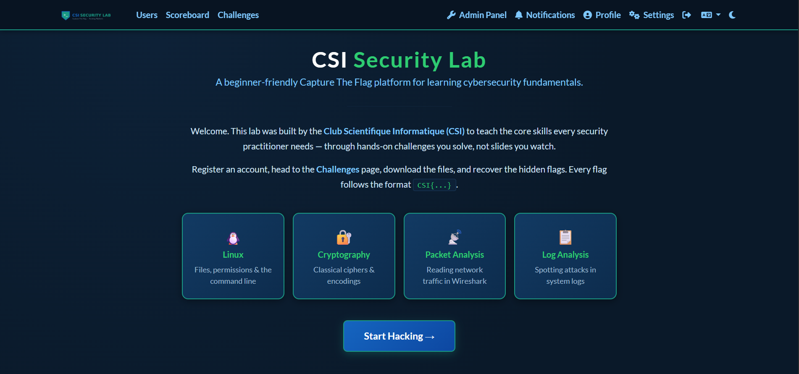
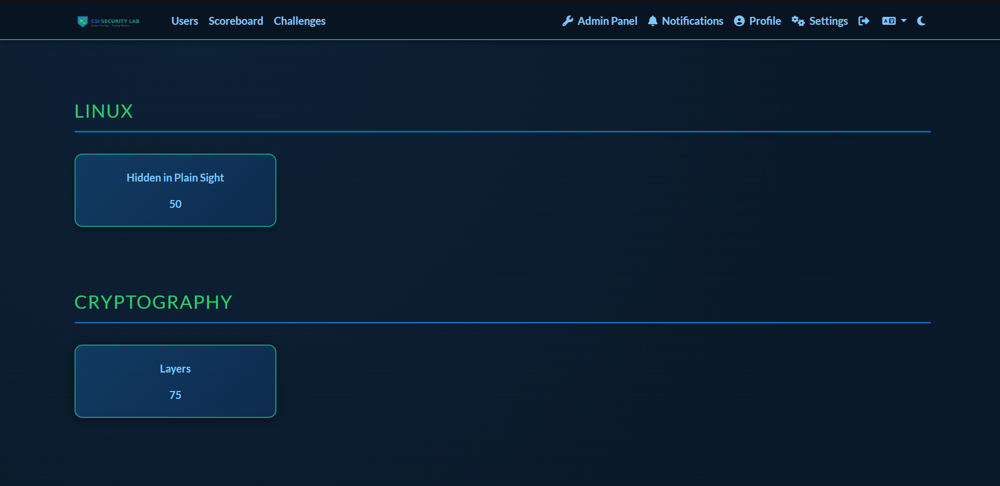
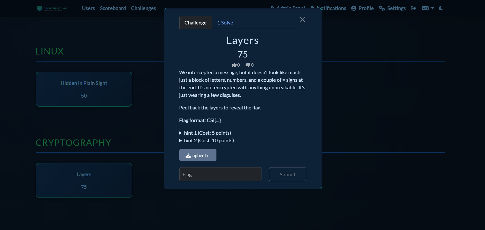
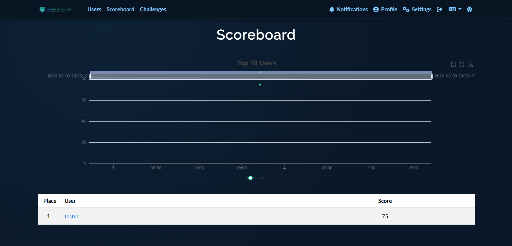

# CSI Security Lab — Self-Hosted CTF Platform

A self-hosted [CTFd](https://ctfd.io/) instance with four custom beginner
challenges, deployed with Docker Compose on a single Ubuntu Server VM. Built
to teach cybersecurity fundamentals — Linux, cryptography, packet analysis,
and log analysis — to a student club audience.



---

## What it is

A small, fully reproducible Capture The Flag platform. Players register an
account, browse challenges grouped by category, download a static file for
each challenge, solve it on their own machine, and submit the flag. There are
no per-challenge live containers — challenges are delivered as downloadable
static files, which keeps the attack surface minimal and the deployment simple.

**Four challenges, one per category:**

| Category | Challenge | Skill taught |
|---|---|---|
| Linux | Hidden in Plain Sight | Hidden files, `ls -la`, navigation |
| Cryptography | Layers | Base64 + ROT13 decoding chain |
| Packet Analysis | Clear Text | Reading plaintext HTTP in Wireshark |
| Log Analysis | Who Got In | Spotting an SSH brute-force in `auth.log` |



---

## Stack

- **Ubuntu Server 24.04 LTS** (VMware Workstation VM)
- **Docker + Docker Compose**
- **CTFd** (official `ctfd/ctfd:3.8.6` image)
- **MariaDB 10.11** (database) and **Redis 4** (cache), from the CTFd
  reference compose file
- Challenge files generated locally: pcap via **Scapy**, logs synthetically
  generated in Python, crypto and Linux built with shell tooling

---

## Flag format

All flags follow the format:

```
CSI{...}
```

Flag *values* are never committed to this repository. They live in a
gitignored `challenges/flags.env` file. Each challenge's `build.sh` reads its
flag from that file and bakes it into the generated challenge file. This means:

- No flag ever appears in version control, in plaintext or inside a committed
  artifact.
- Anyone who clones this repo can regenerate every challenge with **their own**
  flags by creating their own `flags.env`.

See [ARCHITECTURE.md](ARCHITECTURE.md) for the reasoning behind this design.

---

## Deployment

Reproducible from a clean VM. Requires Docker and the Docker Compose plugin.

### 1. Clone

```bash
git clone https://github.com/rafikabdallah/csi-security-lab.git
cd csi-security-lab
```

### 2. Create the infrastructure secrets file

The compose file expects three secrets, supplied via a gitignored `.env`.
Generate them:

```bash
cat > .env << EOF
DB_ROOT_PASSWORD=$(python3 -c "import secrets; print(secrets.token_hex(32))")
DB_PASSWORD=$(python3 -c "import secrets; print(secrets.token_hex(32))")
CTFD_SECRET_KEY=$(python3 -c "import secrets; print(secrets.token_hex(32))")
EOF
chmod 600 .env
```

### 3. Create the challenge flags file

```bash
cat > challenges/flags.env << 'EOF'
FLAG_LINUX=CSI{your_flag_here}
FLAG_CRYPTO=CSI{your_flag_here}
FLAG_PCAP=CSI{your_flag_here}
FLAG_LOG=CSI{placeholder}
EOF
chmod 600 challenges/flags.env
```

> `FLAG_LOG` is overwritten automatically by the log challenge's build script,
> which generates a random attacker IP and derives the flag from it.

### 4. Generate the challenge files

```bash
bash challenges/01-linux/build.sh
bash challenges/02-crypto/build.sh
bash challenges/03-packet-analysis/build.sh
bash challenges/04-log-analysis/build.sh
```

Each writes its player-facing file into `challenges/<name>/dist/`.

### 5. Start the platform

```bash
docker compose up -d
```

CTFd is served on port **8000**. Open `http://<vm-ip>:8000` and complete the
setup wizard (event name, admin account, User mode).

### 6. Load the challenges

There are two ways to get the four challenges into CTFd:

**Fast path — import the template (recommended).** The repo includes
`ctfd-template.zip`, a sanitized CTFd export containing all four challenge
definitions (names, descriptions, categories, points, hints). In the admin
panel go to **Config → Backup → Import** and upload it. Then, for each
challenge, set the real flag (the template ships them blanked as
`CSI{REPLACE_ME}`) and upload the generated file from that challenge's `dist/`
folder. See [CTFD_IMPORT.md](CTFD_IMPORT.md) for details.

**Manual path.** Create each challenge by hand in the admin panel, using each
challenge's `README.md` for the description, points, hints, and flag, and
uploading its generated file.

> Flags and challenge files are supplied manually in both paths, by design:
> shipping either would leak answers into the public repository.

---

## Repository layout

```
csi-security-lab/
├── docker-compose.yml        # CTFd + MariaDB + Redis, secrets externalized
├── .env                      # gitignored — infra secrets
├── .gitignore
├── README.md
├── ARCHITECTURE.md           # design decisions & security reasoning
├── BUILD_LOG.md              # phase-by-phase build record
├── ctfd-template.zip         # sanitized CTFd import (no flags/accounts)
├── CTFD_IMPORT.md            # how to import the template
├── screenshots/
└── challenges/
    ├── flags.env             # gitignored — flag values
    ├── 01-linux/
    │   ├── README.md         # player description, difficulty, hints, points
    │   ├── SOLUTION.md       # write-up
    │   ├── build.sh          # generates the challenge file from flags.env
    │   └── dist/             # gitignored — generated player file
    ├── 02-crypto/
    ├── 03-packet-analysis/
    └── 04-log-analysis/
```

Each challenge folder is self-contained: description, write-up, and a build
script that regenerates the challenge file. `dist/` folders and `flags.env`
are gitignored so no flag-bearing artifact is ever committed.

---

## Screenshots

| | |
|---|---|
|  |  |
|  |  |

---

## Documentation

- **[ARCHITECTURE.md](ARCHITECTURE.md)** — why CTFd, why Docker, the
  container / volume / network layout, isolation considerations, and what
  would need to change before exposing this to a real network.
- **[BUILD_LOG.md](BUILD_LOG.md)** — phase status, decisions, and blockers
  recorded during the build.

---

## Future improvements

- Add a reverse proxy (nginx) with TLS for encrypted access.
- Configure SMTP so email verification can be enabled.
- Place the platform behind a segmented firewall (pfSense / VLANs) before any
  real network exposure.
- Expand to multiple challenges per category.
- Automate challenge import via CTFd's API rather than the admin UI.

---

*Built as a cybersecurity portfolio project. Educational use.*
